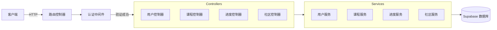
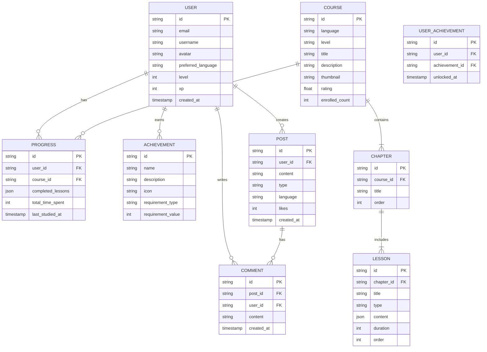

## 1. Architecture Design
```mermaid
graph TB
    subgraph Frontend["前端层"]
        ReactApp["React 应用"]
        Components["组件库"]
        Router["路由管理"]
        State["状态管理 (Zustand)"]
    end
    
    subgraph Backend["后端层"]
        Express["Express API 服务器"]
        Auth["认证模块"]
        CourseService["课程服务"]
        ProgressService["进度服务"]
        CommunityService["社区服务"]
    end
    
    subgraph Database["数据层"]
        Supabase["Supabase PostgreSQL"]
        Storage["文件存储"]
    end
    
    ReactApp --&gt; Router
    ReactApp --&gt; Components
    ReactApp --&gt; State
    ReactApp --&gt; Express
    Express --&gt; Auth
    Express --&gt; CourseService
    Express --&gt; ProgressService
    Express --&gt; CommunityService
    CourseService --&gt; Supabase
    ProgressService --&gt; Supabase
    CommunityService --&gt; Supabase
    Auth --&gt; Supabase
```

## 2. Technology Description
- **前端**: React@18 + TypeScript + Tailwind CSS + Vite
- **初始化工具**: vite-init
- **后端**: Express@4 + TypeScript
- **数据库与认证**: Supabase (PostgreSQL)
- **状态管理**: Zustand
- **路由**: React Router DOM
- **图标**: Lucide React

## 3. Route Definitions
| Route | Purpose |
|-------|---------|
| / | 首页 - 平台介绍、热门课程 |
| /courses | 课程页 - 语言分类、课程列表 |
| /courses/:id | 课程详情页 |
| /learn | 学习页 - 互动练习模块 |
| /progress | 进度页 - 学习数据、成就系统 |
| /community | 社区页 - 动态、问答 |
| /profile | 个人中心 - 用户信息、学习路径 |
| /login | 登录页 |
| /register | 注册页 |

## 4. API Definitions
```typescript
// 用户相关
interface User {
  id: string;
  email: string;
  username: string;
  avatar?: string;
  preferredLanguage: string;
  level: number;
  xp: number;
  createdAt: Date;
}

// 课程相关
interface Course {
  id: string;
  language: string;
  level: 'beginner' | 'elementary' | 'intermediate' | 'advanced';
  title: string;
  description: string;
  thumbnail: string;
  chapters: Chapter[];
  rating: number;
  enrolledCount: number;
}

interface Chapter {
  id: string;
  title: string;
  lessons: Lesson[];
}

interface Lesson {
  id: string;
  title: string;
  type: 'vocabulary' | 'grammar' | 'speaking' | 'listening';
  content: any;
  duration: number;
}

// 进度相关
interface Progress {
  id: string;
  userId: string;
  courseId: string;
  completedLessons: string[];
  totalTimeSpent: number;
  lastStudiedAt: Date;
}

interface Achievement {
  id: string;
  name: string;
  description: string;
  icon: string;
  unlocked: boolean;
  unlockedAt?: Date;
}

// 社区相关
interface Post {
  id: string;
  userId: string;
  user: User;
  content: string;
  type: 'status' | 'question';
  language: string;
  likes: number;
  comments: Comment[];
  createdAt: Date;
}

interface Comment {
  id: string;
  userId: string;
  user: User;
  content: string;
  createdAt: Date;
}
```

## 5. Server Architecture Diagram


## 6. Data Model
### 6.1 Data Model Definition


### 6.2 Data Definition Language
```sql
-- 用户表
CREATE TABLE users (
    id UUID PRIMARY KEY DEFAULT gen_random_uuid(),
    email TEXT UNIQUE NOT NULL,
    username TEXT NOT NULL,
    avatar TEXT,
    preferred_language TEXT DEFAULT 'english',
    level INTEGER DEFAULT 1,
    xp INTEGER DEFAULT 0,
    created_at TIMESTAMP DEFAULT NOW()
);

-- 课程表
CREATE TABLE courses (
    id UUID PRIMARY KEY DEFAULT gen_random_uuid(),
    language TEXT NOT NULL,
    level TEXT NOT NULL CHECK (level IN ('beginner', 'elementary', 'intermediate', 'advanced')),
    title TEXT NOT NULL,
    description TEXT,
    thumbnail TEXT,
    rating REAL DEFAULT 0,
    enrolled_count INTEGER DEFAULT 0
);

-- 章节表
CREATE TABLE chapters (
    id UUID PRIMARY KEY DEFAULT gen_random_uuid(),
    course_id UUID REFERENCES courses(id) ON DELETE CASCADE,
    title TEXT NOT NULL,
    "order" INTEGER NOT NULL
);

-- 课时表
CREATE TABLE lessons (
    id UUID PRIMARY KEY DEFAULT gen_random_uuid(),
    chapter_id UUID REFERENCES chapters(id) ON DELETE CASCADE,
    title TEXT NOT NULL,
    type TEXT NOT NULL CHECK (type IN ('vocabulary', 'grammar', 'speaking', 'listening')),
    content JSONB,
    duration INTEGER,
    "order" INTEGER NOT NULL
);

-- 学习进度表
CREATE TABLE progress (
    id UUID PRIMARY KEY DEFAULT gen_random_uuid(),
    user_id UUID REFERENCES users(id) ON DELETE CASCADE,
    course_id UUID REFERENCES courses(id) ON DELETE CASCADE,
    completed_lessons JSONB DEFAULT '[]',
    total_time_spent INTEGER DEFAULT 0,
    last_studied_at TIMESTAMP DEFAULT NOW(),
    UNIQUE(user_id, course_id)
);

-- 成就表
CREATE TABLE achievements (
    id UUID PRIMARY KEY DEFAULT gen_random_uuid(),
    name TEXT NOT NULL,
    description TEXT,
    icon TEXT NOT NULL,
    requirement_type TEXT NOT NULL,
    requirement_value INTEGER NOT NULL
);

-- 用户成就关联表
CREATE TABLE user_achievements (
    id UUID PRIMARY KEY DEFAULT gen_random_uuid(),
    user_id UUID REFERENCES users(id) ON DELETE CASCADE,
    achievement_id UUID REFERENCES achievements(id) ON DELETE CASCADE,
    unlocked_at TIMESTAMP DEFAULT NOW(),
    UNIQUE(user_id, achievement_id)
);

-- 社区帖子表
CREATE TABLE posts (
    id UUID PRIMARY KEY DEFAULT gen_random_uuid(),
    user_id UUID REFERENCES users(id) ON DELETE CASCADE,
    content TEXT NOT NULL,
    type TEXT NOT NULL CHECK (type IN ('status', 'question')),
    language TEXT NOT NULL,
    likes INTEGER DEFAULT 0,
    created_at TIMESTAMP DEFAULT NOW()
);

-- 评论表
CREATE TABLE comments (
    id UUID PRIMARY KEY DEFAULT gen_random_uuid(),
    post_id UUID REFERENCES posts(id) ON DELETE CASCADE,
    user_id UUID REFERENCES users(id) ON DELETE CASCADE,
    content TEXT NOT NULL,
    created_at TIMESTAMP DEFAULT NOW()
);

-- 启用行级安全策略
ALTER TABLE users ENABLE ROW LEVEL SECURITY;
ALTER TABLE courses ENABLE ROW LEVEL SECURITY;
ALTER TABLE progress ENABLE ROW LEVEL SECURITY;
ALTER TABLE posts ENABLE ROW LEVEL SECURITY;
ALTER TABLE comments ENABLE ROW LEVEL SECURITY;

-- 创建策略
CREATE POLICY "Users can view their own data" ON users
    FOR SELECT USING (auth.uid()::text = id::text);

CREATE POLICY "Users can update their own data" ON users
    FOR UPDATE USING (auth.uid()::text = id::text);

CREATE POLICY "Anyone can view courses" ON courses
    FOR SELECT USING (true);

CREATE POLICY "Users can view their own progress" ON progress
    FOR SELECT USING (auth.uid()::text = user_id::text);

CREATE POLICY "Users can update their own progress" ON progress
    FOR ALL USING (auth.uid()::text = user_id::text);

CREATE POLICY "Anyone can view posts" ON posts
    FOR SELECT USING (true);

CREATE POLICY "Authenticated users can create posts" ON posts
    FOR INSERT WITH CHECK (auth.role() = 'authenticated');

CREATE POLICY "Anyone can view comments" ON comments
    FOR SELECT USING (true);

CREATE POLICY "Authenticated users can create comments" ON comments
    FOR INSERT WITH CHECK (auth.role() = 'authenticated');

-- 授予权限
GRANT SELECT ON courses TO anon;
GRANT ALL PRIVILEGES ON users TO authenticated;
GRANT ALL PRIVILEGES ON progress TO authenticated;
GRANT SELECT, INSERT ON posts TO authenticated;
GRANT SELECT, INSERT ON comments TO authenticated;
GRANT SELECT ON achievements TO anon;
GRANT SELECT, INSERT ON user_achievements TO authenticated;
```

