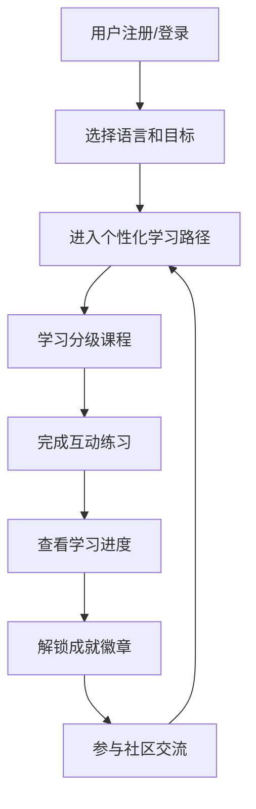

## 1. Product Overview
多语种在线学习平台，提供英语、日语、韩语等主流语言的沉浸式学习体验。平台通过分级课程、互动练习、进度追踪和社区功能，帮助用户高效学习语言。

## 2. Core Features

### 2.1 User Roles
| Role | Registration Method | Core Permissions |
|------|---------------------|------------------|
| 普通用户 | 邮箱/手机号注册 | 学习课程、完成练习、查看进度、社区交流 |

### 2.2 Feature Module
1. **首页**：平台介绍、热门课程展示、学习统计
2. **课程页**：分级课程体系、课程详情、章节学习
3. **学习页**：单词记忆、语法练习、口语跟读、听力训练
4. **进度页**：学习进度追踪、成就展示、学习数据统计
5. **社区页**：用户交流、学习分享、问答互动
6. **个人中心**：用户信息、个性化设置、学习路径推荐
7. **登录注册页**：用户认证、账号管理

### 2.3 Page Details
| Page Name | Module Name | Feature description |
|-----------|-------------|---------------------|
| 首页 | 英雄区域 | 平台标语、语言选择、快速开始学习按钮 |
| 首页 | 热门课程 | 各语言热门课程卡片展示、课程评分 |
| 首页 | 学习进度 | 近期学习数据、今日学习目标 |
| 课程页 | 语言分类 | 英语、日语、韩语等语言筛选 |
| 课程页 | 课程列表 | 分级课程（入门/初级/中级/高级）展示 |
| 课程页 | 课程详情 | 课程介绍、课程大纲、学习要求 |
| 学习页 | 单词记忆 | 闪卡模式、拼写练习、词义匹配 |
| 学习页 | 语法练习 | 选择题、填空题、句子重组 |
| 学习页 | 口语跟读 | 音频播放、录音对比、发音评分 |
| 学习页 | 听力训练 | 听力材料、题目作答、解析查看 |
| 进度页 | 进度概览 | 学习时长、完成课程数、掌握单词数 |
| 进度页 | 成就系统 | 徽章展示、成就解锁、等级提升 |
| 进度页 | 学习记录 | 每日学习数据、学习曲线图表 |
| 社区页 | 动态流 | 用户分享、学习心得、互动评论 |
| 社区页 | 问答区 | 问题发布、回答互动、点赞收藏 |
| 个人中心 | 个人信息 | 头像、昵称、学习目标设置 |
| 个人中心 | 学习路径 | 基于进度的个性化课程推荐 |
| 登录注册页 | 登录 | 邮箱/手机号登录、密码重置 |
| 登录注册页 | 注册 | 账号创建、信息完善、语言偏好设置 |

## 3. Core Process
用户注册/登录 → 选择学习语言和目标 → 进入个性化学习路径 → 学习课程并完成互动练习 → 查看学习进度和成就 → 参与社区交流

## 4. User Interface Design
### 4.1 Design Style
- **主色调**：深蓝色 (#1e40af)，代表专注与学习
- **辅助色**：青色 (#06b6d4) 用于强调按钮，橙色 (#f59e0b) 用于成就徽章
- **按钮风格**：圆角设计，带有轻微阴影和悬停动画
- **字体**：使用 Noto Sans 系列，支持多语言显示
- **布局风格**：卡片式布局，清晰的信息层级
- **图标风格**：简洁现代的线性图标，配合平滑过渡动画

### 4.2 Page Design Overview
| Page Name | Module Name | UI Elements |
|-----------|-------------|-------------|
| 首页 | 英雄区域 | 渐变背景、大标题、动画按钮、语言选择下拉 |
| 首页 | 热门课程 | 卡片网格、课程封面、评分星星、进度条 |
| 学习页 | 互动模块 | 练习卡片、倒计时、进度指示器、反馈动画 |
| 进度页 | 数据统计 | 图表组件、数据卡片、成就徽章墙 |
| 个人中心 | 学习路径 | 时间线布局、推荐课程卡片、进度可视化 |

### 4.3 Responsiveness
桌面优先设计，同时适配平板和移动设备，确保在各种屏幕尺寸上都有良好的用户体验。

